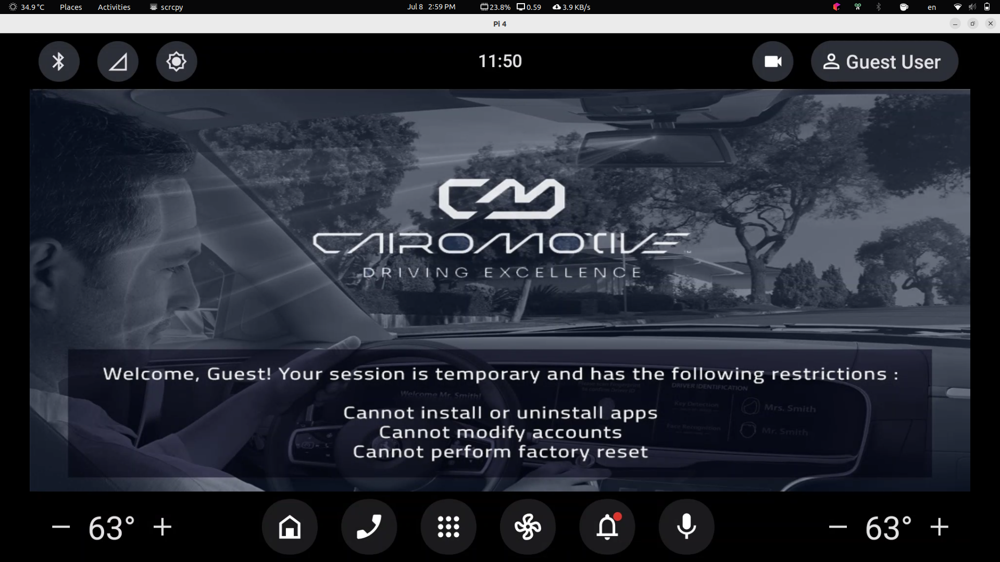

# AAOS_Driver_ID
This repository integrates the Phase One (Personalized App) and Phase Two (Face Authentication Demo) components to deliver our final target application.  The application uses the camera to detect the driver’s face and automatically opens the corresponding Android profile.

-----------------------
## 🚘 Product Vision

Deliver seamless personalization for drivers using biometric recognition. Each time a known driver enters the vehicle:
- They are greeted with a custom splash screen including their name.
- Their Android user profile is automatically loaded.
- New users are prompted to register easily via face capture.

----------------------

## Automatic Driver Recognition:

 

------------------

## Profile Personalization:

 

-------------------

## Create Multiple Users:

 

-------------------

## Delete User

 

----------------

## Guest User

 

------------

## AOSP Architecture & Project Integration

 

-----------

## Project Architecture

 

-----------

--------------
## 👨‍💻 Team Members

- [Mohamed Awadin](https://github.com/MohamedAwadin)
- [Omar Mohamed](https://github.com/omarmohamedmoustafa)
- [Rahma Abdelkader](https://github.com/rahmaabdelkader2)
- [Esraa Fawzy](https://github.com/Esraa-f28)
------------